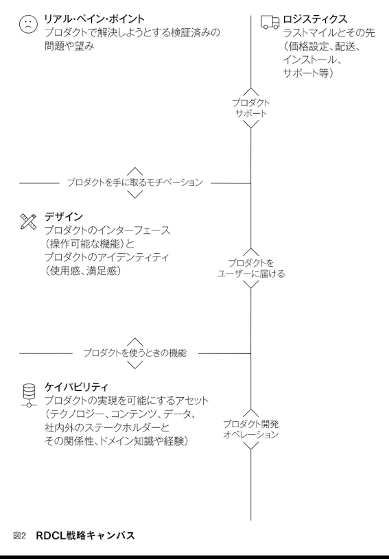
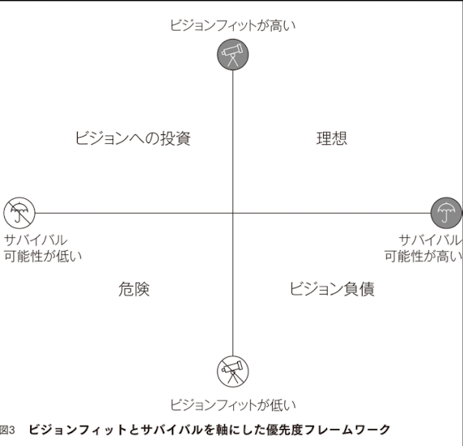
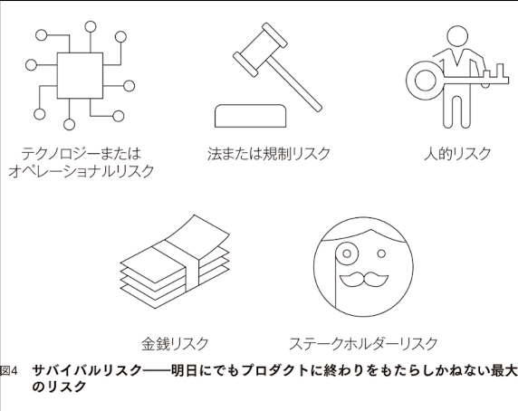

---
kindle-sync:
  bookId: '36259'
  title: ラディカル・プロダクト・シンキング イノベーティブなソフトウェア・サービスを生み出す5つのステップ
  author: ラディカ・ダット、曽根原 春樹、長谷川 圭
  asin: B09YTP7NFB
  lastAnnotatedDate: '2025-08-24'
  bookImageUrl: 'https://m.media-amazon.com/images/I/71pOQg1mv3L._SY160.jpg'
  highlightsCount: 78
---
# ラディカル・プロダクト・シンキング イノベーティブなソフトウェア・サービスを生み出す5つのステップ
## Metadata
* Author: [ラディカ・ダット、曽根原 春樹、長谷川 圭](https://www.amazon.comundefined)
* ASIN: B09YTP7NFB
* Reference: https://www.amazon.com/dp/B09YTP7NFB
* [Kindle link](kindle://book?action=open&asin=B09YTP7NFB)

## Highlights

## プロダクトビジョン

どのようなユーザーのどんな問題を、どんな価値を提供し続けることで解決していくのか。
そのプロダクトが広がった先にユーザーの世界はどのように変わるのか。 — location: [43](kindle://book?action=open&asin=B09YTP7NFB&location=43) ^ref-42733

この世界観へ共感してくれる顧客に「行動変容」を促し続けられるかどうかである。 — location: [46](kindle://book?action=open&asin=B09YTP7NFB&location=46) ^ref-16740

---
## ローカルマキシマムかグローバルマキシマム

ローカルマキシマムを見つけようとする行為は、たとえるなら、チェスで負けそうになっているときに一部のピースだけを眺めながら最善の手を考えるようなこと。
対照的に、グローバルマキシマムを見つけるとは、チェス盤全体を眺めながら長いゲームにとって最高の一手を打つことを意味する。 — location: [217](kindle://book?action=open&asin=B09YTP7NFB&location=217) ^ref-33550

たとえば、「……分野で最高になる」や「……に革命を起こす」など — location: [223](kindle://book?action=open&asin=B09YTP7NFB&location=223) ^ref-62714
イテレーション型ビジョンの例

---
## ビジョン駆動型のアプローチ

顧客と密接な関係を結び、ワークフローに対する顧客のニーズを探り、プロダクト群に欠けている要素を見定める — location: [330](kindle://book?action=open&asin=B09YTP7NFB&location=330) ^ref-18569
隙間が見つかれば、それを埋めるための追加機能を開発する。要するに、私たちにとっては顧客が研究開発部門の役割を担っていた。 — location: [331](kindle://book?action=open&asin=B09YTP7NFB&location=331) ^ref-38366

---
## ラディカル・プロダクト・シンキング
世界にどんな変化をもたらしたいかを考えながらグローバルマキシマムを探し求める態度 — location: [375](kindle://book?action=open&asin=B09YTP7NFB&location=375) ^ref-52706

リーンとアジャイルは目的地を示さない — location: [516](kindle://book?action=open&asin=B09YTP7NFB&location=516) ^ref-60775

世界にもたらしたいと願う変化によってインスパイアされ、その変化を起こすのに必要なメカニズムであるプロダクトについて徹底的に考える — location: [564](kindle://book?action=open&asin=B09YTP7NFB&location=564) ^ref-1832
⭐️

#### 哲学
1. プロダクトを世界に変化を起こすためのメカニズムとみなす — location: [573](kindle://book?action=open&asin=B09YTP7NFB&location=573) ^ref-37439
2. プロダクトづくりを始める前に、世界にもたらしたい変化を思い描く — location: [578](kindle://book?action=open&asin=B09YTP7NFB&location=578) ^ref-13827
	あなたの望む変化を起こすことだけがプロダクトの存在理由であり、思い描いた目標にあなたがたどり着いて初めて、そのプロダクトは成功したと — location: [580](kindle://book?action=open&asin=B09YTP7NFB&location=580) ^ref-12364

3. ビジョンを日々の活動に結びつけることで変化を起こす — location: [584](kindle://book?action=open&asin=B09YTP7NFB&location=584) ^ref-33945

●ラディカル・プロダクト・シンキングが方向性を、リーンとアジャイルがスピードを与える。両方がそろって方向性のあるベロシティーになる 
●ラディカル・プロダクト・シンキングの考え方では、世界を望む形に変えるために必要な、絶えず改善されるメカニズムはすべてプロダクトと位置づけられる — location: [745](kindle://book?action=open&asin=B09YTP7NFB&location=745) ^ref-30262

---
## プロダクト病💀

#### ヒーロー症候群
インパクトを強くすることだけに集中し、もともと胸に思い描いていた変化の創造をないがしろにするとき、 ヒーロー症候群 が発症する。 — location: [763](kindle://book?action=open&asin=B09YTP7NFB&location=763) ^ref-52418

#### 戦略肥大
次々と舞い込んでくるアイデアや要望につい「イエス」と言ってしまい、最後には何から手をつけるべきかがわからなくなる。 — location: [794](kindle://book?action=open&asin=B09YTP7NFB&location=794) ^ref-31998

数多くの機能を提供すると、競争の起こる前線の数も増え、ライバルのオファーに対して自らのそれを差別化するのがよりいっそう難しくなる。 — location: [816](kindle://book?action=open&asin=B09YTP7NFB&location=816) ^ref-53008
🍄

#### 数値指標依存症
何を計測すべきかを知るには、自分がどこにたどり着きたいのかを理解しておかなければならない。何でも測るという道を選ぶと、あらゆるものを測定しているうちに、本当に大切なことを見失って — location: [865](kindle://book?action=open&asin=B09YTP7NFB&location=865) ^ref-39778

#### ロックイン症候群
ただそれに慣れているから、あるいはそれまで問題がなかったからという理由で、まるで殻に閉じこもるかのように特定の技術やアプローチなどを用いつづけるとき、 ロックイン症候群 が発症 — location: [879](kindle://book?action=open&asin=B09YTP7NFB&location=879) ^ref-60354

#### ピボット症候群
自分が起こそうとしている変化に魅力を感じ、明確なビジョンを追いつづけている限り、方向転換よりも正面突破のほうが問題の解決につながりやすいはず — location: [926](kindle://book?action=open&asin=B09YTP7NFB&location=926) ^ref-55072

戦略肥大を起こしている企業では、あらゆる機能が〝最優先〟とみなされます — location: [971](kindle://book?action=open&asin=B09YTP7NFB&location=971) ^ref-33366
💀

---
## ビジョン

あなたとチームはともにつくる世界のビジョンとして、その==変化が起こったあとの世界をはっきりと想像==できなければならない — location: [1069](kindle://book?action=open&asin=B09YTP7NFB&location=1069) ^ref-15805

ゴールが抽象的な漠然とした何かではなく、具体的で明確であれば、人々がそれを受け入れ、自らの夢にする可能性が高くなる。 — location: [1070](kindle://book?action=open&asin=B09YTP7NFB&location=1070) ^ref-6614

#### ラディカル・ビジョンステートメント

現在［特定のグループ］が［望ましい結果］を望むとき、彼・彼女らは［現状の解決策］しなければならない。この状況は［現行解決策の欠点］のため、受け入れられない。我々は［欠点の克服された］世界を夢見ている。我々は［テクノロジー/アプローチ］を通じて、そのような世界を実現するつもりである。 — location: [1113](kindle://book?action=open&asin=B09YTP7NFB&location=1113) ^ref-46010
⭐️

**深い問いに対して、チームメンバーの全員が独自の言葉で同じビジョンを語れるようにする** — location: [1130](kindle://book?action=open&asin=B09YTP7NFB&location=1130) ^ref-46770

ビジョンは特定の行動を除外できるほど詳しくなければならない。
言い換えれば、すべての行動や活動がビジョンと互換性があるようでは、何かがおかしい — location: [1142](kindle://book?action=open&asin=B09YTP7NFB&location=1142) ^ref-33581
⭐️

ビジョン進化ステートメント を最終ゴールの設定に活用 — location: [1149](kindle://book?action=open&asin=B09YTP7NFB&location=1149) ^ref-46144

我々は［基本テクノロジー/アプローチ］を通じて［顧客セグメント］が［活動/成果］を行う方法を変えることから始めた。 それ以来ずっと学習と成長を続け、今、次の大きなステップは［最終状況］だと確信している。 — location: [1150](kindle://book?action=open&asin=B09YTP7NFB&location=1150) ^ref-43461
⭐️

現状を打破することに快感を覚える。彼・彼女らには現状が我慢ならない。
だから、ものすごい時間をかけて世界を変える方法を考えるのである。
ブレインストーミングを行うとき、イノベーターは==〝もしこれをやったら、何が起こるだろうか？〟==と — location: [1210](kindle://book?action=open&asin=B09YTP7NFB&location=1210) ^ref-32153

あなたにとって現状は受け入れられないものでも、あなたがインパクトを与えようとしている相手の人にとっては、現状はそれほどひどくないのかもしれない可能性を認める — location: [1217](kindle://book?action=open&asin=B09YTP7NFB&location=1217) ^ref-61193
💀

崇高な最終状態を想定したくなる気持ちはわかる。リジャットの場合、最終状態として「女性の権利の拡大」などと宣言されてもおかしくない — location: [1226](kindle://book?action=open&asin=B09YTP7NFB&location=1226) ^ref-22436
💀
ビジョン（ゴール）までの論理（パス）が不明確である。すると、自分たちの立ち位置、進むべき方向が分からなくなる

望まれる変化をもたらすために絶えず改善が可能なメカニズムとプロダクトを定義する — location: [1243](kindle://book?action=open&asin=B09YTP7NFB&location=1243) ^ref-3475

あなたのビジョンの影響が容易に実感できない性質であるなら、チームメンバーにそれを体験できる機会を特別に設ける必要がある — location: [1280](kindle://book?action=open&asin=B09YTP7NFB&location=1280) ^ref-29266

ビジョナリーモメントを引き起こすだけでなく、チームの全員がそれぞれビジョンに対してどのような貢献ができるかを理解させることも重要 — location: [1318](kindle://book?action=open&asin=B09YTP7NFB&location=1318) ^ref-39455
ビジョナリーモーメントとは、ビジョンが顧客にインパクトを与える瞬間

組織全体としてのビジョンに則した独自のビジョンステートメントを作成する権限を与え、ビジョナリーを育成 — location: [1367](kindle://book?action=open&asin=B09YTP7NFB&location=1367) ^ref-36541

---
## RDCL戦略

---
R＝リアル・ペイン・ポイント（真の問題点） — location: [1430](kindle://book?action=open&asin=B09YTP7NFB&location=1430) ^ref-2677
D＝デザイン — location: [1433](kindle://book?action=open&asin=B09YTP7NFB&location=1433) ^ref-41975
C＝ケイパビリティ（能力） — location: [1439](kindle://book?action=open&asin=B09YTP7NFB&location=1439) ^ref-39560
L＝ロジスティクス — location: [1444](kindle://book?action=open&asin=B09YTP7NFB&location=1444) ^ref-16210

## ステップ1 ユーザーのリアル・ペイン・ポイントを見つける

ターゲット顧客と彼・彼女らのペイン・ポイントを定義するとき、大切なのはそのペイン・ポイントがリアルであること — location: [1481](kindle://book?action=open&asin=B09YTP7NFB&location=1481) ^ref-1153
リアル・ペイン・ポイント（真の問題点）
⭐️

あなたは痛みを感じている人々を自分の目で見ただろうか？　それとも、顧客は痛みを抱えていると予想しただけ？ — location: [1511](kindle://book?action=open&asin=B09YTP7NFB&location=1511) ^ref-17705
🍄

ターゲットとなる顧客セグメントを特定し、ペイン・ポイントの立証が済めば、優先するペイン・ポイントを決めることが可能になる — location: [1527](kindle://book?action=open&asin=B09YTP7NFB&location=1527) ^ref-11778

## ステップ2 ラディカル・プロダクトをデザインする

あなたのプロダクトのどんな機能がその問題を解決するのだろうか？
🍄

優れたデザインとは戦略に適合し、戦略を前に進めるデザインのことである — location: [1543](kindle://book?action=open&asin=B09YTP7NFB&location=1543) ^ref-53813

プロダクトをどうデザインするかについて語るとき、私たちは実際には人々による**プロダクトの利用方法（インターフェース）とプロダクトに対する認識（アイデンティティ）をどう意図的に形成するか**について語っている — location: [1544](kindle://book?action=open&asin=B09YTP7NFB&location=1544) ^ref-3556

どんな機能があれば、彼・彼女らは目的を果たしやすくなるだろうか？ — location: [1561](kindle://book?action=open&asin=B09YTP7NFB&location=1561) ^ref-34494

#### プロダクトのアイデンティティを考える
・ユーザーはリアル・ペイン・ポイントに直面するとき、どんな感情を抱くだろうか？ 
・そのような感情を前提にして、あなたのプロダクトを使うことがどのような感情につながるだろうか？　わくわくする？　安心できる？　楽しい？ 
・望ましい感情を呼びさますために、映像、音声、テキスト、あるいはほかの体験を使って何が — location: [1587](kindle://book?action=open&asin=B09YTP7NFB&location=1587) ^ref-11394
⭐️

## ステップ3 ケイパビリティを定義する

ケイパビリティは「どうすればデザインに価値を届ける力を込める（デザインに約束させる）ことができるだろうか？」という問いに答えること — location: [1597](kindle://book?action=open&asin=B09YTP7NFB&location=1597) ^ref-24545
🍄

ケイパビリティは、あなたの組織で、あなたのデザインに力を授ける、あなただけがもつ（もしくはあなたが開発する任を負う）特別な動力源 — location: [1605](kindle://book?action=open&asin=B09YTP7NFB&location=1605) ^ref-53011

デザインを通じてケイパビリティを隠すのがいい。そうすることで、ユーザーはボンネットの下のことを意識せずに、インターフェースやプロダクトの使用感を楽しめる — location: [1633](kindle://book?action=open&asin=B09YTP7NFB&location=1633) ^ref-32842
デザインの独特な力を生むのがケイパビリティ — location: [1635](kindle://book?action=open&asin=B09YTP7NFB&location=1635) ^ref-36560

## ステップ4 ロジスティクスを定義する

プロダクトをどうやって人々に届けるか、という問題 — location: [1638](kindle://book?action=open&asin=B09YTP7NFB&location=1638) ^ref-27956
🍄

・プロダクトをどのようにして人々に届けるか？　どんな経路で販売するか？ 
・人々はどのプラットフォームでプロダクトを使うだろうか？　紙？　モバイルデバイス上のアプリ？　それとも基本的にデスクからアクセスすることになるウェブページ？ 
・人々はプロダクトを利用するに当たってトレーニングが必要だろうか？　問題が生じたときどうやってサポートするか？ 
・価格とビジネスモデルはどうするか？ — location: [1648](kindle://book?action=open&asin=B09YTP7NFB&location=1648) ^ref-20882
⭐️

---
## 優先順位
#### ビジョンを日々の行動に落とし込む

バランス感覚のない者は自分で決断して新しい何かを始めることを難しく — location: [1719](kindle://book?action=open&asin=B09YTP7NFB&location=1719) ^ref-8309
長期目標と短期目標をバランスよくトレードオフする — location: [1721](kindle://book?action=open&asin=B09YTP7NFB&location=1721) ^ref-13744
🍄

#### FW

「ビジョンへの投資」 
長期ビジョンの実現に少しずつ近づくためには、左上の「ビジョンへの投資」領域に含まれる機会も選択する必要がある — location: [1750](kindle://book?action=open&asin=B09YTP7NFB&location=1750) ^ref-18882

「ビジョン負債」 
負債が増えすぎると、プロダクトで目指していた目標が達成できなくなってしまう — location: [1754](kindle://book?action=open&asin=B09YTP7NFB&location=1754) ^ref-57566

**ビジョン駆動型のプロダクトを開発するつもりなら、「理想」と「ビジョンへの投資」の領域を多く選択**し、「ビジョン負債」と「危険」の領域はできるだけ避けるべき — location: [1759](kindle://book?action=open&asin=B09YTP7NFB&location=1759) ^ref-39674

ビジョン負債が増える可能性が高まる
・あらゆるユーザーにそれぞれのカスタムソリューションを提供する 
・契約を結ぶために、プロダクトに1回限りの機能をつけ足す 
・自らのプロダクトの中核に、競合他社の技術やコンテンツやデータを利用する 
・収益を増やすが、プライバシーや社会的倫理を犠牲にする機能を追加する — location: [1768](kindle://book?action=open&asin=B09YTP7NFB&location=1768) ^ref-40885
💀

ビジョンに投資するとは、あなたがビジョンを尊重し、意思決定に反映させているという事実を、自らの行動を通じてチームに示すこと — location: [1795](kindle://book?action=open&asin=B09YTP7NFB&location=1795) ^ref-42271

ビジネスを閉鎖に追い込みかねない最大級のリスクを見極め、その影響力を弱める — location: [1814](kindle://book?action=open&asin=B09YTP7NFB&location=1814) ^ref-55809
プロダクトの存続にとって最大のリスクを短い文章にまとめる — location: [1827](kindle://book?action=open&asin=B09YTP7NFB&location=1827) ^ref-24752

現在、我々のプロダクトの存続にとって最大のリスクは［最大のリスク］である。 もしこのリスクが生じれば、我々は［リスクの影響］により事業を続けることができなくなるだろう。 このリスクは［リスクを増大させる要因］ときに現実になる可能性が最も高くなる。 このリスクを軽減する役に立つ要素として、［リスクを軽減する要素］を挙げることができる。 — location: [1830](kindle://book?action=open&asin=B09YTP7NFB&location=1830) ^ref-42672
⭐️

「だから何なのか？（So What?）」を問いつづける態度がリスクの影響を見極める鍵 — location: [1871](kindle://book?action=open&asin=B09YTP7NFB&location=1871) ^ref-28988
🍄

どのスプリントでも「ビジョンへの投資」に開発力の25パーセントを割く — location: [1921](kindle://book?action=open&asin=B09YTP7NFB&location=1921) ^ref-30741

---
