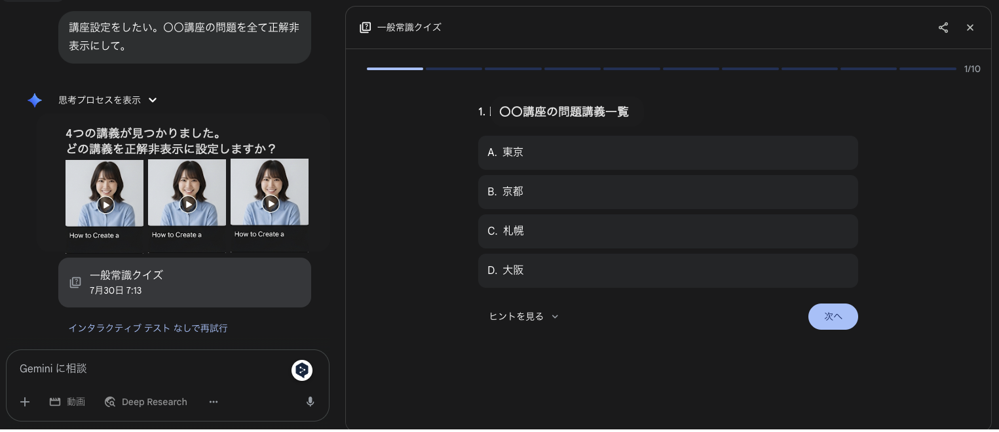
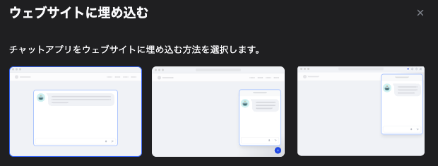

# お客様の疑問を3秒で解決する組織へ

〜講座作成自動化で実現する究極のCS〜

---

## プロダクトビジョン

〜誰も迷わない組織を目指しましょう〜

### ステークホルダーの未来

- お客様　　：使い方の疑問すら生まれない
- 開発チーム：仕様の曖昧さゼロで、開発スピード向上

---

### 管理者画面の未来

---

## 現状の問題

〜原因は「情報の分散」と「精度の不備」です〜

### 根本的な要因

- 使い方サイトの効果が測定できない（読まれているか不明）
- ドキュメントが点在し、開発チーム内での仕様理解にバラつき

---

## 目標

〜講座作成自動化で「情報の中央集権化」を実現します〜

### 実現する価値

- Playwright活用
	- 自動のブラウザ操作で、ドキュメント整備
- Difyチャットボット
	- お客様の疑問を瞬時解決

---

## **追記 （8月15日）**

### ClaudeCode ＆ Devin を活用して、情報の中央集権化は実現する

---
### 投資対効果

宮下さんが懸念される「精度」問題を根本解決し、
CS体験の質を向上

---

## 副次効果による開発効率向上

〜Playwrightによる自動化基盤がもたらす複合的価値〜

### 開発速度と品質の向上

- [機能 & E2Eテスト自動化](https://zenn.dev/aldagram_tech/articles/3614dbabbf2f5d#ai%E3%81%A8%E5%AF%BE%E8%A9%B1%EF%BC%88page-object%EF%BC%86%E3%83%86%E3%82%B9%E3%83%88%E4%B8%80%E6%8B%AC%E4%BD%9C%E6%88%90%E7%B7%A8%EF%BC%89)
- [UX評価自動化](https://qiita.com/Takenoko4594/items/cc36ca3043f11ca175c1)

---

## 導入（インターナル）

〜内部プロセス改善に特化した活用〜

### 導入方針

- 対象領域：Trelloカード作成支援・devinのE2Eテスト手順書作成（開発・コーディング作業は対象外）
- 測定指標：開発範囲・再現手順予測の正解率、E2Eテスト実行成功確率
- 改善サイクル：各指標データを基にしたPDCA運用
